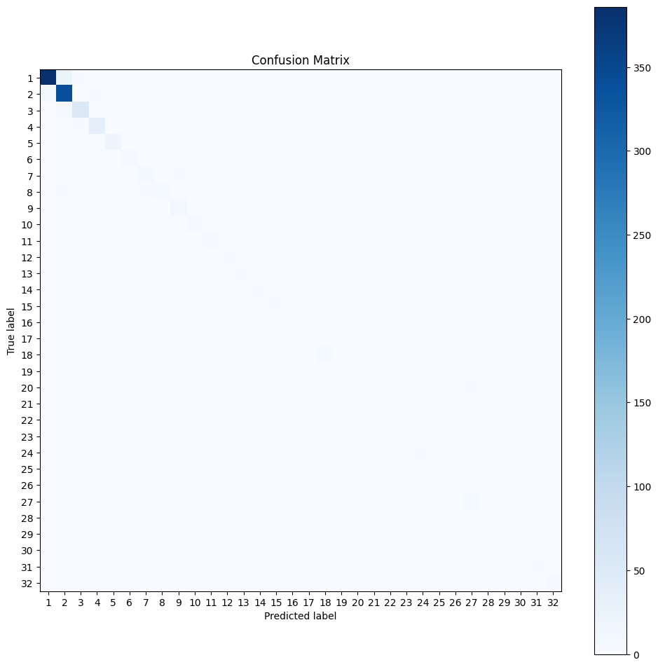
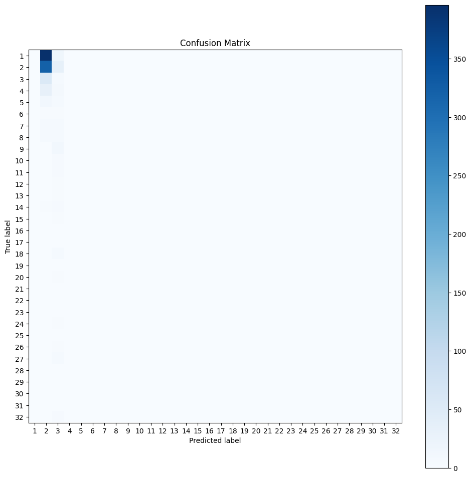

### Custom CNN Classification 50 epochs 1 half of the dataset 2 and above data augmentation
- Accuracy: 0,681

### VGG 16 Classification 50 epochs 1 half of the dataset 2 and above data augmentation
- Accuracy: 0,936

### VGG 16 Regression 10 epochs 1 half of the dataset 2 and above data augmentation
- Number of errors: 630
- Total number of images: 966
- Accuracy: 0,3478

### VGG 16 Regression 50 epochs 1 half of the dataset 2 and above data augmentation
- Number of errors: 640
- Total number of images: 966
- Accuracy: 0,3375

